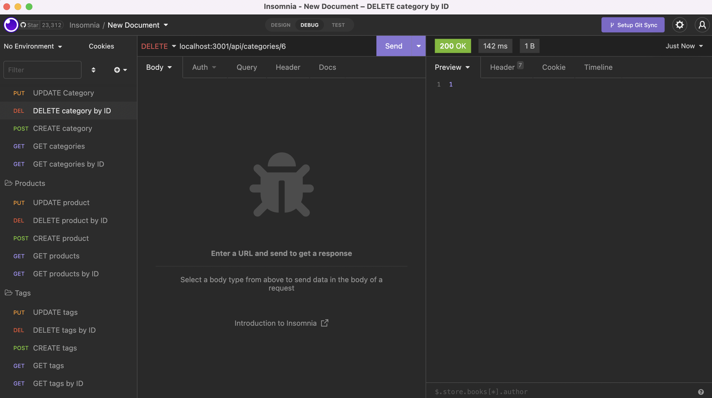

## Description

In this assignment I was tasked to make a mysql database and application backend for an e-commerce site. Built using dotenv, Express, Sequelize, and MySQL2.
  
Below is the video showing the functionality of the application:
  
[Setup](https://drive.google.com/file/d/1py1DNQmhjHZaTZno47HLkItZKprC2Nml/view?usp=sharing)

[Insomnia](https://drive.google.com/file/d/1FJxZeIIv4INzKNgqG9Uw_hFMavs2o-CP/view?usp=sharing)

### Create


### DELETE by ID


### GET all


### GET by ID


### UPDATE

  
## User Story
  
```
AS A manager at an internet retail company
I WANT a back end for my e-commerce website that uses the latest technologies
SO THAT my company can compete with other e-commerce companies
```
  
## Acceptance Criteria
  
``` 
GIVEN a functional Express.js API
WHEN I add my database name, MySQL username, and MySQL password to an environment variable file
THEN I am able to connect to a database using Sequelize
WHEN I enter schema and seed commands
THEN a development database is created and is seeded with test data
WHEN I enter the command to invoke the application
THEN my server is started and the Sequelize models are synced to the MySQL database
WHEN I open API GET routes in Insomnia for categories, products, or tags
THEN the data for each of these routes is displayed in a formatted JSON
WHEN I test API POST, PUT, and DELETE routes in Insomnia Core
THEN I am able to successfully create, update, and delete data in my database
```
  
## Table of Contents
- [Description](#description)
- [User Story](#user-story)
- [Acceptance Criteria](#acceptance-criteria)
- [Table of Contents](#table-of-contents)
- [Installation](#installation)
- [Usage](#usage)
- [Testing](#testing)
- [Contributing](#contributing)
- [Questions](#questions)

## Installation   
  
`npm init`

`npm install mysql2`

`npm install sequelize`

`npm install dotenv`
  
## Usage
  
Run the following command at the root of your project and answer the prompted questions:

`mysql -u root -p`

Enter password when promted

`source db/schema.sql`

`quit`

`npm run seed`
  
`npm start`

## Testing

No testing is currently set up

## Contributing
Scott Wattenbarger

## Questions
Contact me with any questions: [email](mailto:scottwattenbarger@gmail.com) , [GitHub](https://github.com/scottwatt)<br />